<h1 id="head1">수행 방법</h1>

Amazon Textract를 테스트하기 위해 AWS Services 중 다음 Resources를 사용합니다.

- **S3 (Simple Storage Serivce)** : Object Storage로서 분석할 문서 이미지 데이터 파일 (PNG, JPEG, PDF) 을 저장하는데 사용합니다.
- **SageMaker Notebook** : Python으로 Amazon Textract 를 실행하기 위한 테스트 환경을 생성합니다.
- **IAM (Identity and Access Management)** : Amazon Textract, SNS, SQS, Comprehend 등을 실행하기 위한 접근 권한을 관리합니다.

먼저 아래 Region 중 하나를 선택하여 클릭합니다. 그러면, 자동으로 CloudFormation을 통해 위 Demo 환경이 만들어 집니다. 

<table>
<thead>
<tr>
<th align="center">Region</th>
<th align="left">Launch Template</th>
</tr>
</thead>
<tbody>
<tr>
<td align="center">N. Virginia (us-east-1)</td>
<td align="left"><a  href="https://console.aws.amazon.com/cloudformation/home?region=us-east-1#/stacks/create/review?stackName=amazon-textract-demo&amp;templateURL=https://napkin-share.s3.ap-northeast-2.amazonaws.com/cloudformation/amazon-textract-demo.yml&amp;" target="_blank"  class="btn btn-default">
  <i class="fas fa-play"></i>
Deploy to AWS N. Virginia
</a>
</td>
</tr>

<tr>
<td align="center">Ohio (us-east-2)</td>
<td align="left"><a  href="https://console.aws.amazon.com/cloudformation/home?region=us-east-2#/stacks/create/review?stackName=amazon-textract-demo&amp;templateURL=https://napkin-share.s3.ap-northeast-2.amazonaws.com/cloudformation/amazon-textract-demo.yml&amp;" target="_blank"  class="btn btn-default">
  <i class="fas fa-play"></i>
Deploy to AWS Ohio
</a>
</td>
</tr>

<tr>
<td align="center">N. California (us-west-1)</td>
<td align="left"><a  href="https://console.aws.amazon.com/cloudformation/home?region=us-west-1#/stacks/create/review?stackName=amazon-textract-demo&amp;templateURL=https://napkin-share.s3.ap-northeast-2.amazonaws.com/cloudformation/amazon-textract-demo.yml&amp;" target="_blank"  class="btn btn-default">
  <i class="fas fa-play"></i>
Deploy to AWS N. California
</a>
</td>
</tr>

<tr>
<td align="center">Oregon (us-west-2)</td>
<td align="left"><a  href="https://console.aws.amazon.com/cloudformation/home?region=us-west-2#/stacks/create/review?stackName=amazon-textract-demo&amp;templateURL=https://napkin-share.s3.ap-northeast-2.amazonaws.com/cloudformation/amazon-textract-demo.yml&amp;" target="_blank"  class="btn btn-default">
  <i class="fas fa-play"></i>
Deploy to AWS Oregon
</a>
</td>
</tr>

<tr>
<td align="center">Singapore (ap-southeast-1)</td>
<td align="left"><a  href="https://console.aws.amazon.com/cloudformation/home?region=ap-southeast-1#/stacks/create/review?stackName=amazon-textract-demo&amp;templateURL=https://napkin-share.s3.ap-northeast-2.amazonaws.com/cloudformation/amazon-textract-demo.yml&amp;" target="_blank"  class="btn btn-default">
  <i class="fas fa-play"></i>
Deploy to AWS Singapore
</a>
</td>
</tr>

<tr>
<td align="center">Sydney (ap-southeast-2)</td>
<td align="left"><a  href="https://console.aws.amazon.com/cloudformation/home?region=ap-southeast-2#/stacks/create/review?stackName=amazon-textract-demo&amp;templateURL=https://napkin-share.s3.ap-northeast-2.amazonaws.com/cloudformation/amazon-textract-demo.yml&amp;" target="_blank"  class="btn btn-default">
  <i class="fas fa-play"></i>
Deploy to AWS Sydney
</a>
</td>
</tr>

<tr>
<td align="center">Ireland (eu-west-1)</td>
<td align="left"><a  href="https://console.aws.amazon.com/cloudformation/home?region=eu-west-1#/stacks/create/review?stackName=amazon-textract-demo&amp;templateURL=https://napkin-share.s3.ap-northeast-2.amazonaws.com/cloudformation/amazon-textract-demo.yml&amp;" target="_blank"  class="btn btn-default">
  <i class="fas fa-play"></i>
Deploy to AWS Ireland
</a>
</td>
</tr>

<tr>
<td align="center">London (eu-west-2)</td>
<td align="left"><a  href="https://console.aws.amazon.com/cloudformation/home?region=eu-west-2#/stacks/create/review?stackName=amazon-textract-demo&amp;templateURL=https://napkin-share.s3.ap-northeast-2.amazonaws.com/cloudformation/amazon-textract-demo.yml&amp;" target="_blank"  class="btn btn-default">
  <i class="fas fa-play"></i>
Deploy to AWS London
</a>
</td>
</tr>

</tbody>
</table>
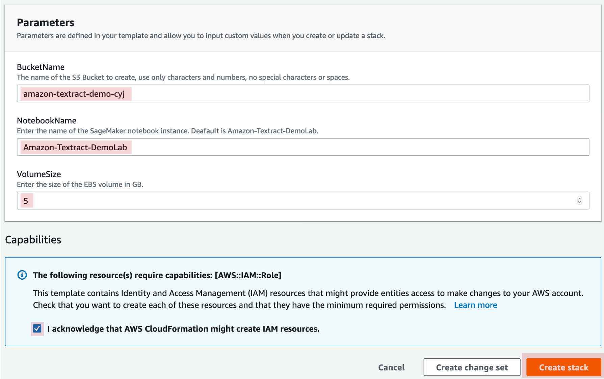

AWS Console에 로그인을 한 후 CloudFormation에서 요구하는 Parameters 정보를 추가합니다. XXX를 다른 문자로 추가합니다. 

- **S3 Bucket Name** : amazon-textract-demo-XXX (Globally unique 해야 한다는 점으로 고려하여 어떤 이름으로도 수정이 가능함)
- **NotebookName** : SageMaker Notebook 이름 (default : Amazon-Textract-DemoLab)
- **VolumeSize** : SageMaker Notebook에서 사용하는 EBS 용량 조정 (default : 5 GB)

각 Parameters 값을 수정한 다음 하단 체크박스를 체크한 후 <strong>Create Stack</strong> 버튼을 클릭합니다.

이 단계에서 보통 발생하는 에러는 S3 Bucket의 이름이 중복이 되는 경우, CloudFormation의 Stack Name이 이미 존재하는 경우입니다. 해당 경우에는 이름을 변경하여 다시 Create 를 하시면 정상적으로 테스트 환경이 생성됩니다.

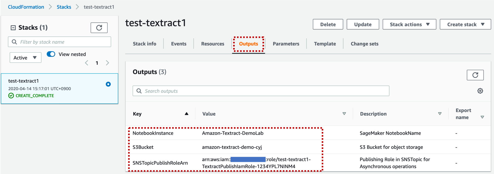

CloudFormation에서 생성이 완료된 후 위 그림과 같이 Output 탭에서 결과를 볼 수 있으며 해당 결과를 이후 작업에서 이용하게 됩니다. CloudFormation의 Output 탭에는 생성된 S3 Bucket과 SageMaker notebook 이름, SNSTopicPublishRoleArn 정보를 확인할 수 있습니다. <code>SNSTopicPublishRoleArn</code>는 PDF 파일을 분석하는 Asynchronous 방식의 2번째 SageMaker Notebook 에서 활용하므로 메모장 등에 복사해서 바로 사용할 수 있도록 합니다.

먼저 S3 서비스로 이동하여 생성된 S3 Bucket에서 문서 이미지 파일을 upload 합니다. (S3 Bucket 이름은 Output 탭에서 확인이 가능합니다.)

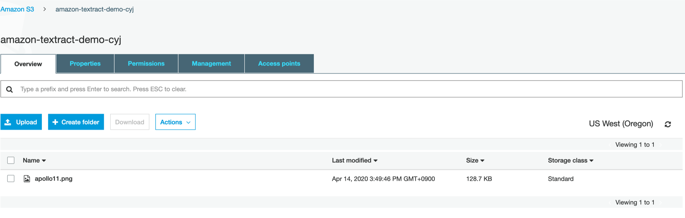

생성한 region 내 SageMaker로 가면 이미 생성한 Notebook Instance를 확인할 수 있으며, Notebook Instance를 들어가서 Textract 폴더로 이동하여 각 SageMaker Notebook 파일을 수행하시면 됩니다.

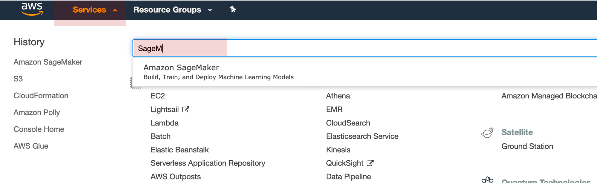

상단 탭에 Services를 클릭한 다음 검색창에 SageMaker를 입력한 다음 Amazon SageMaker를 클릭합니다.

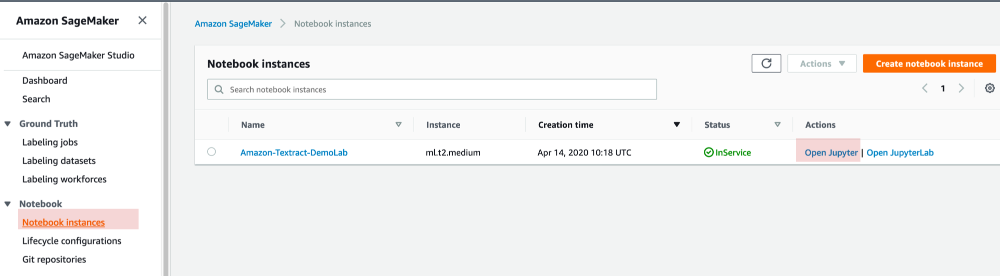

왼쪽 메뉴바에서 Notebook Instance를 클릭한 다음 CloudFormation으로 생성한 Notebook과 동일한 이름을 instance의 오른쪽 Actions에서 Open Jupyter를 클릭합니다.

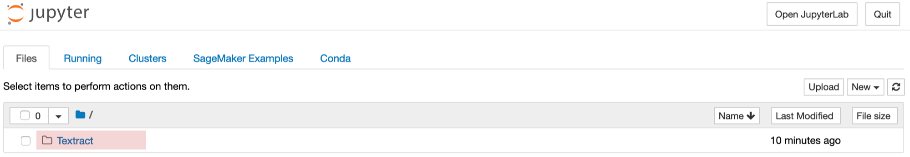

Notebook에는 github에 저장되어 있던 Textract 폴더를 확인할 수 있으며, 폴더를 클릭하여 들어가면 테스트를 위해 실행할 수 있는 3개의 노트북 파일을 확인할 수 있습니다.

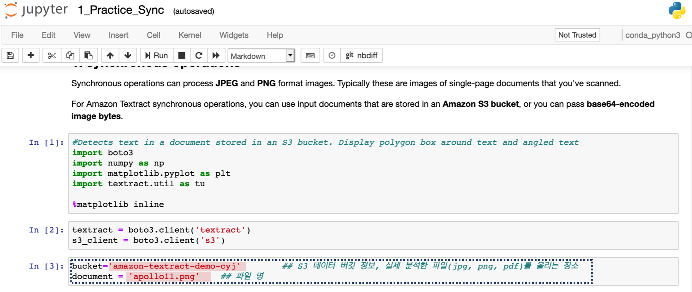

1번 SageMaker Notebook의 경우 <strong>PNG, JPG/JPEG</strong>에 대해 synchronous하게 결과를 바로 받아볼 수 있습니다. 노트북 파일에서 파란색 박스의 값만 S3 bucket의 이름과 upload한 이미지 이름으로 추가한 후 실행을 하면 결과를 확인할 수 있습니다.

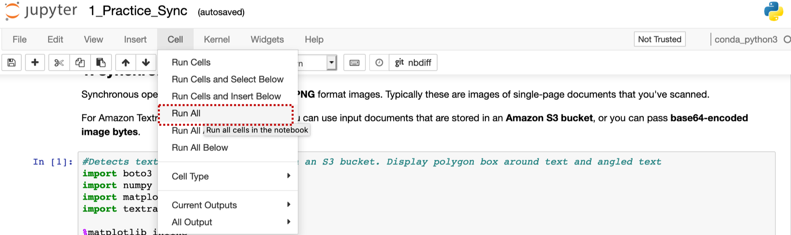
SageMaker Notebook을 전체 실행하는 방법은 기존 Jupyter Notebook과 동일하게 상단 탭에서 Cell - Run All을 수행하면 됩니다.

<strong>PDF</strong>의 경우 다중 페이지가 존재하며 파일의 분석 대상이 커질 수 있으므로 Asynchronous하게만 분석이 가능합니다.
<code>2_Practice_Async.ipynb</code>를 먼저 수행한 다음, <code>3_Practice_Async_Result.ipynb</code>를 수행하는 방식으로 순차적으로 수행해야 합니다.

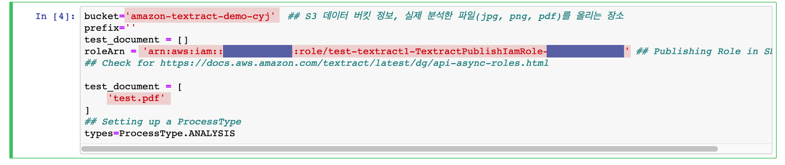

<code>2_Practice_Async.ipynb</code>의 4번째 cell을 위 그림과 같이 추가합니다. RoleArn에는 앞서 CloudFormation의 output 탭에서 복사해 놓은 <code>SNSTopicPublishRoleArn</code>값을 입력합니다. test_document는 앞서 설명드린 S3 bucket에 이미 upload한 파일들을 추가하면 됩니다. test_document는 list 타입으로 구분자(<strong>,</strong>)로 복수의 파일들을 추가할 수 있습니다. PDF외 PNG, JPG/JPEG 모두 가능합니다.

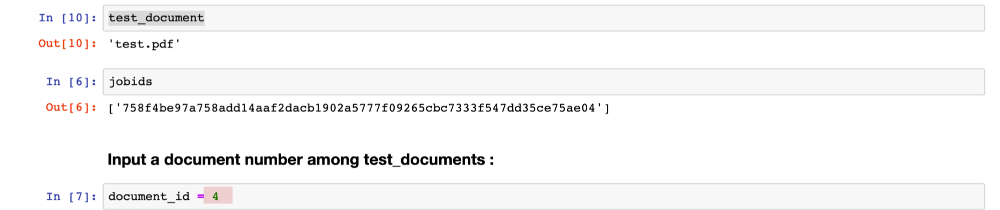

<code>2_Practice_Async.ipynb</code>에서 분석한 문서가 복수 개일 경우에는 각 문서의 번호를 변경하면서 분석 결과를 확인할 수 있습니다. 1개일 경우에는 1로 하면 됩니다.

또한, 문서 내 복수 개의 페이지일 경우에는 아래 그림처럼 page_num를 변경합니다. 현재는 페이지별로 1장 씩 결과를 확인할 수 있도록 구성하였습니다. 페이지를 변경한 후 전체 수행하거나 수정된 위치 다음부터 변경을 하면서 결과를 확인할 수 있습니다.

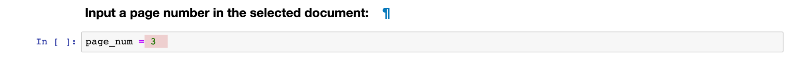

<h1 id="head1">Limits</h1> https://docs.aws.amazon.com/textract/latest/dg/limits-document.html
